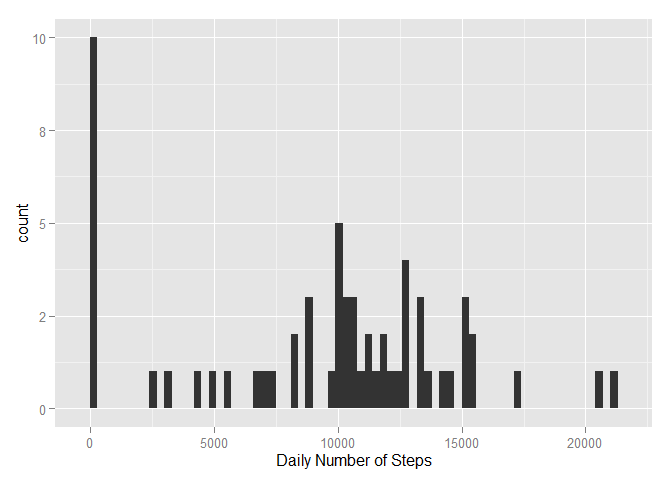
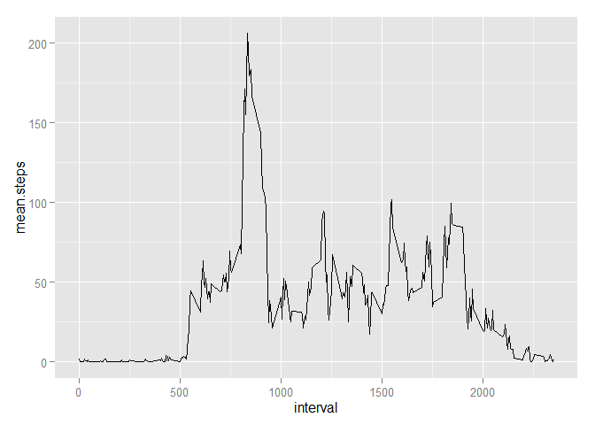
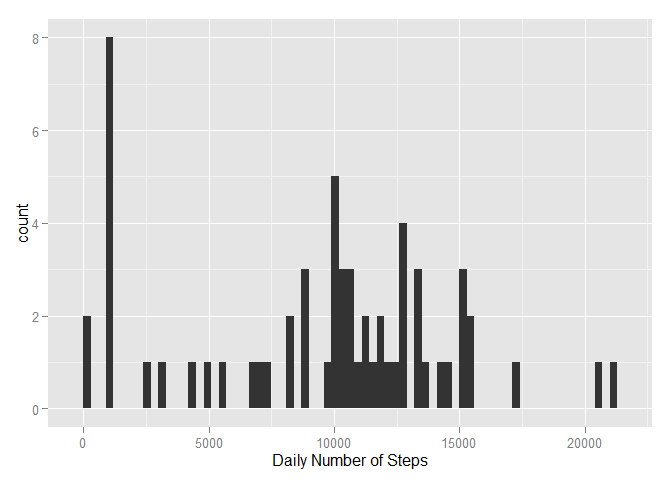
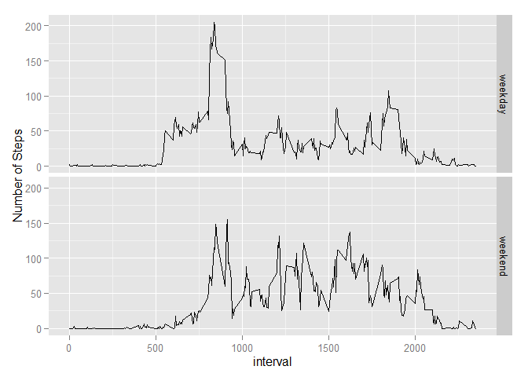

# Reproducible Research: Peer Assessment 1


## Loading and preprocessing the data
*Load the data (i.e. read.csv())


```r
setwd("C:/Users/PHUNKMJ/Desktop/Coursera/Modules5")

library(plyr)
library(ggplot2)
library(knitr)
options(digits=0)

activitydf <- read.csv("activity.csv") # read the datafile from csv
activitydf$date <- as.POSIXct(activitydf$date) # set the dates to POSIXct
```

## What is mean total number of steps taken per day?
*Make a histogram of the total number of steps taken each day
*Calculate and report the mean and median of the total number of steps taken per day


```r
#Calculate the total number of steps taken per day
dailysteps <- aggregate(activitydf$steps, by = list(activitydf$date), sum, na.rm=TRUE) 
names(dailysteps) <- c("Date", "steps")

#Make a histogram of the total number of steps taken each day
qplot(steps, data = dailysteps, geom="histogram", xlab = "Daily Number of Steps", binwidth = 300)
```

 

```r
#Calculate and report the mean and median of the total number of steps taken per day
mean.steps <- mean(dailysteps$steps) 
median.steps <- median(dailysteps$steps)
```
The mean number of steps each day is 9354.  
The median number of steps each day is 10395.

## What is the average daily activity pattern?
Make a time series plot of the 5-minute interval (x-axis) and the average number of steps taken, averaged across all days (y-axis)


```r
#df of the mean and median number of steps taken, averaged across all days (y-axis)
intsteps <- aggregate(activitydf$steps, by = list(activitydf$interval), mean, na.rm=TRUE)
intstepsmed <- aggregate(activitydf$steps, by = list(activitydf$interval), median, na.rm=TRUE)

intsteps <- cbind(intsteps[], intstepsmed$x)

#Tidy the df names and round the numbers
names(intsteps) = c("interval","mean.steps", "median.steps")
intsteps$mean.steps <- intsteps$mean.steps
intsteps$median.steps <- intsteps$median.steps


ggplot(intsteps, aes(x = interval, y = mean.steps)) + geom_line()
```

 

```r
most.steps <- intsteps$interval[intsteps$mean.steps == max(intsteps$mean.steps)]
```
The interval with the most steps each day (on average is) : 835.

## Imputing missing values

Make a histogram of the total number of steps taken each day and Calculate and report the mean and median total number of steps taken per day.

```r
#find the NAs
na.steps <- subset(activitydf, is.na(steps))
num.NAs <-length(na.steps$steps)

#replace the NAs with the median number of steps for that period
nstps <- data.frame(date=activitydf$date[is.na(activitydf$steps)], interval = activitydf$interval[is.na(activitydf$steps)], steps=intsteps[match(intsteps$interval, activitydf$interval[is.na(activitydf$steps)]),3])

# remove the NA's from the period
activitydf <- subset(activitydf, !is.na(steps))

# Append the median steps to the Activity DF
activitydf <- rbind(activitydf, nstps)

#sum the number of steps each day into the dailysteps2 DF and get the mean and median 
dailysteps2 <- aggregate(activitydf$steps, by = list(activitydf$date), sum, na.rm=TRUE)
names(dailysteps2) <- c("Date", "steps")

qplot(steps, data = dailysteps2, geom="histogram", xlab = "Daily Number of Steps", binwidth = 300)
```

 

```r
mean.steps2 <- mean(dailysteps2$steps) # 
median.steps2 <- median(dailysteps2$steps)
```

There are 2304 intervals with NA

The new mean number of steps is 9504 this is close to the mean from the data with NAs of 9354. 
THe new median number of steps is 10395 this is the same as the median from the data with NAs of 10395. There is little impact to the estimated number of steps a day from using the median for the time interval to replace the missing data. I had previously used the mean but this introduced a sizeable difference.

## Are there differences in activity patterns between weekdays and weekends?


```r
# Add the Weekday/weekend identifier

activitydf$week <- ifelse(weekdays(activitydf$date) == "Saturday" | weekdays(activitydf$date) == "Sunday" ,"weekend","weekday")

#df of the mean and median number of steps taken, averaged across all days (y-axis)
intsteps2 <- aggregate(activitydf$steps, by = list(activitydf$week, activitydf$interval), mean, na.rm=TRUE)
intstepsmed2 <- aggregate(activitydf$steps, by = list(activitydf$week, activitydf$interval), median, na.rm=TRUE)

intsteps2 <- cbind(intsteps2[], intstepsmed2$x)

#Tidy the df names and round the numbers
names(intsteps2) = c("weekday", "interval","mean.steps", "median.steps")
intsteps2$mean.steps <- round(intsteps2$mean.steps)
intsteps2$median.steps <- round(intsteps2$median.steps)


ggplot(intsteps2, aes(x = interval, y = mean.steps)) + ylab("Number of Steps") + geom_line() + facet_grid(weekday~.)
```

 
As can be seen from the plots above the user appears to start walking around later at weekends (maybe they sleep later). Once they are awake they tend to take more steps and to be walking around (awake?) later in the day.
